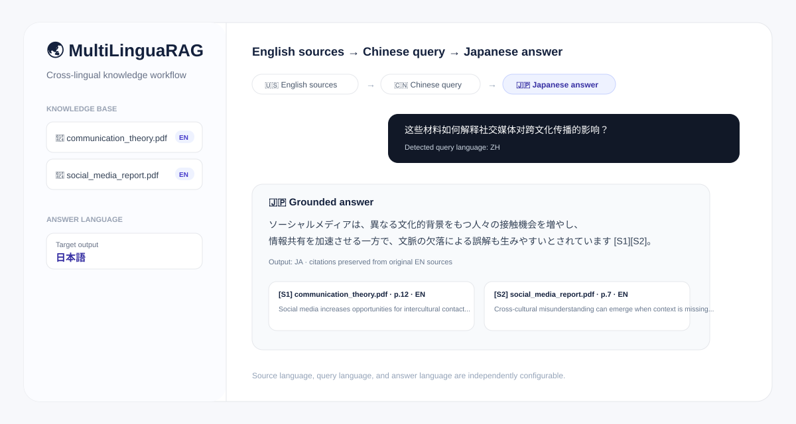

# 🌏 MultiLinguaRAG

**A cross-lingual RAG assistant where the source language, query language, and answer language are independently configurable.**

> Example: **English source documents → Chinese question → Japanese grounded answer + original citations.**

## ✨ What it does

- Uploads knowledge sources in **Chinese, Japanese, English, or a mixture of them**.
- Parses PDF / DOCX / PPTX / XLSX / Markdown / TXT / HTML / CSV with **Docling**.
- Uses **Docling HybridChunker** for structure-aware, tokenizer-aware chunks.
- Uses **Qwen3-Embedding-0.6B** for multilingual and cross-lingual dense retrieval.
- Stores vectors + source metadata in local **Qdrant**.
- Retrieves **Top-K evidence across languages**.
- Lets the user choose the **answer language independently**: Auto, Chinese, Japanese, or English.
- Generates grounded answers through the **OpenAI Responses API** when an API key is configured.
- Shows source citations and the actual retrieved evidence in a **Streamlit** UI.

## 🖥️ Demo



The repository includes a static portfolio demo in [`docs/index.html`](docs/index.html).

> The static page is a preview of the intended UX. Real retrieval scores and model answers are produced only when the local RAG pipeline is running.

## 🔥 Core design: three languages are decoupled

A normal multilingual chatbot often assumes that the user asks and receives an answer in the same language. MultiLinguaRAG separates three independent language roles:

```text
1. Source / Knowledge Language
2. Query Language
3. Target Answer Language
```

They do **not** have to match.

Example:

```text
Knowledge base:
🇺🇸 English research papers

User query:
🇨🇳 中文
“这些材料对跨文化传播的主要观点是什么？”

Answer language:
🇯🇵 Japanese

Output:
🇯🇵 日本語で根拠付きの回答
+ citations back to the original English sources
```

This is useful in multilingual academic and professional workflows—for example, preparing Japanese teaching materials from English research sources while interacting with the system in Chinese.

## ⌨️ Inputs and outputs

### Inputs

MultiLinguaRAG takes **three inputs**:

1. **Knowledge-base documents** — Chinese, Japanese, English, or mixed-language files.
2. **User query** — a question in Chinese, Japanese, or English.
3. **Target answer language** — `Auto`, `Chinese`, `Japanese`, or `English`.

### Outputs

The system returns:

1. **Grounded answer in the selected target language**.
2. **Top-K retrieved evidence chunks**.
3. **Source citations** with filename, page when available, source language, section headings, and similarity score.

## 🧠 Core architecture

```text
Multilingual documents
ZH / JA / EN / mixed
        │
        ▼
     Docling
        │
        ▼
  HybridChunker
        │
        ▼
Qwen3-Embedding
        │
        ▼
      Qdrant
        ▲
        │
User query (ZH / JA / EN)
        │
        ▼
 Query Embedding
        │
        ▼
Cross-lingual Top-K Retrieval
        │
        ▼
 Retrieved Evidence
        │
        ├─────────────── Target Answer Language
        │                  Auto / ZH / JA / EN
        ▼
       LLM
        │
        ▼
Grounded Answer + Citations
```

## 🌐 Why this is cross-lingual RAG

The key feature is not simply storing three languages in one database. The retriever can match semantic meaning across languages, while the generation stage can independently control the output language.

```text
English source
      ↓
Chinese query
      ↓
Qwen3 multilingual embedding
      ↓
Retrieve English evidence
      ↓
Target language = Japanese
      ↓
Japanese grounded answer
```

This separates:

- **Cross-lingual retrieval:** query language can differ from document language.
- **Cross-lingual generation:** answer language can differ from both query and document language.

## 🧰 Stack

| Layer | Technology |
|---|---|
| Document parsing | Docling |
| Chunking | Docling HybridChunker |
| Embedding | Qwen/Qwen3-Embedding-0.6B |
| Embedding runtime | sentence-transformers |
| Vector database | Qdrant local persistent mode |
| Generation | OpenAI Responses API |
| UI | Streamlit |
| Project management | uv + pyproject.toml |

## 🚀 Quick start

### 1. Install dependencies

```bash
uv sync
```

### 2. Configure environment

```bash
cp .env.example .env
```

`OPENAI_API_KEY` is optional. Without it, retrieval still works and the app displays retrieved evidence, but answer generation is disabled.

### 3. Index sample documents

```bash
uv run multilinguarag-ingest data/sample --recreate
```

### 4. Query with an independent answer language

English source / multilingual knowledge base, Chinese question, Japanese output:

```bash
uv run multilinguarag-query \
  "这些材料里 RAG 的主要作用是什么？" \
  --answer-language ja
```

Other options:

```text
--answer-language auto   # same language as the query
--answer-language zh     # Simplified Chinese
--answer-language ja     # Japanese
--answer-language en     # English
```

### 5. Launch the Streamlit app

```bash
uv run streamlit run app.py
```

In the sidebar, choose **Answer language** independently from the uploaded document language and the language of the question.

## 📁 Repository structure

```text
MultiLinguaRAG/
├── app.py
├── data/
│   ├── sample/
│   └── uploads/
├── scripts/
│   ├── ingest.py
│   └── query.py
├── src/multilinguarag/
│   ├── cli.py
│   ├── config.py
│   ├── embedder.py
│   ├── generator.py
│   ├── ingestion.py
│   ├── language.py
│   ├── models.py
│   ├── rag.py
│   └── vectorstore.py
├── docs/
│   ├── index.html
│   └── demo-preview-v3.svg
├── tests/
├── INTERVIEW_GUIDE.md
├── pyproject.toml
└── LICENSE
```

## 🔍 Important implementation choices

### 🔥 1. Source language, query language, and output language are independent

The retriever does not translate every document into the query language first. Qwen3-Embedding maps multilingual semantic content into a shared vector space. The output language is controlled later in the generation prompt.

### 🔥 2. Retrieval happens before output-language generation

The selected answer language does **not** change which source language must be retrieved. Retrieval is based on semantic relevance; the LLM then expresses the grounded evidence in the requested target language.

### 🔥 3. Citations always point to the original sources

If an English paper is retrieved and the final answer is Japanese, the citation still points to the original English paper and page. The answer language does not rewrite source provenance.

### 🔥 4. V1 stays intentionally simple

No BM25, reranker, query rewriting, agent routing, CRAG, or Self-RAG is included. The goal is to make the core pipeline understandable and testable before adding complexity.

## 🎯 Interview questions

Be ready to answer:

1. What is the difference between source language, query language, and answer language?
2. How can a Chinese query retrieve an English or Japanese source?
3. Why not translate every document into the user's language before indexing?
4. How do you force the answer to be Japanese when the query is Chinese?
5. Does changing the answer language affect retrieval?
6. How are citations preserved when the source and answer languages differ?
7. Why use a multilingual embedding model?
8. What is Top-K and what are the trade-offs?
9. How would you evaluate cross-lingual retrieval separately from generation quality?
10. How would you test English-source → Chinese-query → Japanese-answer workflows?

See **[INTERVIEW_GUIDE.md](INTERVIEW_GUIDE.md)** for answer frameworks.

## 📊 Recommended evaluation

Evaluate retrieval and generation separately.

### Retrieval

Create labeled query-source pairs such as:

- zh query → en source
- zh query → ja source
- ja query → en source
- en query → zh source

Report **Recall@K** and **MRR**.

### Generation

For the same retrieved evidence, test multiple target languages and evaluate:

- groundedness to the retrieved evidence
- citation correctness
- semantic consistency across output languages
- terminology preservation

## 🗺️ Optional future work

Only after V1 is evaluated:

- multilingual reranker
- hybrid dense + sparse retrieval
- metadata filtering
- parent-child retrieval
- generation consistency evaluation across languages

## License

MIT for the code in this repository. Third-party libraries and model weights remain subject to their own licenses and terms.
